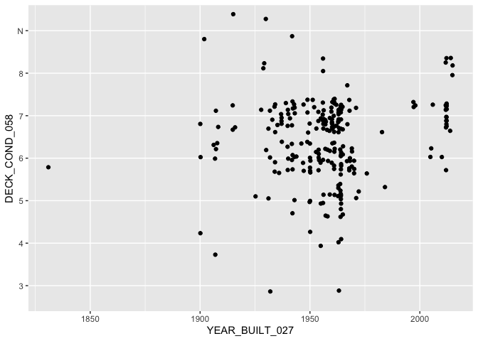

Bridges Homework
================
Steven Xia
2/4/2021

[**My Github Repository
Here**](https://github.com/sxia35/homework1.git)

``` r
districtColumbia <- read_csv("https://www.fhwa.dot.gov/bridge/nbi/2019/delimited/DC19.txt")
```

    ## Parsed with column specification:
    ## cols(
    ##   .default = col_double(),
    ##   STRUCTURE_NUMBER_008 = col_character(),
    ##   ROUTE_NUMBER_005D = col_character(),
    ##   HIGHWAY_DISTRICT_002 = col_character(),
    ##   COUNTY_CODE_003 = col_character(),
    ##   PLACE_CODE_004 = col_character(),
    ##   FEATURES_DESC_006A = col_character(),
    ##   CRITICAL_FACILITY_006B = col_logical(),
    ##   FACILITY_CARRIED_007 = col_character(),
    ##   LOCATION_009 = col_character(),
    ##   LRS_INV_ROUTE_013A = col_logical(),
    ##   LAT_016 = col_character(),
    ##   LONG_017 = col_character(),
    ##   MAINTENANCE_021 = col_character(),
    ##   OWNER_022 = col_character(),
    ##   FUNCTIONAL_CLASS_026 = col_character(),
    ##   DESIGN_LOAD_031 = col_character(),
    ##   RAILINGS_036A = col_character(),
    ##   TRANSITIONS_036B = col_character(),
    ##   APPR_RAIL_036C = col_character(),
    ##   APPR_RAIL_END_036D = col_character()
    ##   # ... with 28 more columns
    ## )

    ## See spec(...) for full column specifications.

``` r
districtColumbiaSmall <- select(districtColumbia, STRUCTURE_NUMBER_008, YEAR_BUILT_027, 
                                STATE_CODE_001, COUNTY_CODE_003, PLACE_CODE_004,
                                DECK_COND_058, SUPERSTRUCTURE_COND_059, SUBSTRUCTURE_COND_060,
                                CHANNEL_COND_061, CULVERT_COND_062, OPR_RATING_METH_063,
                                OPERATING_RATING_064, INV_RATING_METH_065, INVENTORY_RATING_066)
                                
head(districtColumbiaSmall)
```

    ## # A tibble: 6 x 14
    ##   STRUCTURE_NUMBE… YEAR_BUILT_027 STATE_CODE_001 COUNTY_CODE_003 PLACE_CODE_004
    ##   <chr>                     <dbl>          <dbl> <chr>           <chr>         
    ## 1 0001                       1937             11 001             00000         
    ## 2 0002                       1831             11 001             00000         
    ## 3 0003                       1900             11 001             00000         
    ## 4 0004                       1929             11 001             00000         
    ## 5 0005                       1929             11 001             00000         
    ## 6 0006                       1900             11 001             00000         
    ## # … with 9 more variables: DECK_COND_058 <chr>, SUPERSTRUCTURE_COND_059 <dbl>,
    ## #   SUBSTRUCTURE_COND_060 <dbl>, CHANNEL_COND_061 <chr>,
    ## #   CULVERT_COND_062 <chr>, OPR_RATING_METH_063 <dbl>,
    ## #   OPERATING_RATING_064 <dbl>, INV_RATING_METH_065 <dbl>,
    ## #   INVENTORY_RATING_066 <dbl>

``` r
ggplot(districtColumbiaSmall, aes(x = YEAR_BUILT_027, y = DECK_COND_058)) +
  geom_jitter(width = 0.25)
```

<!-- -->
